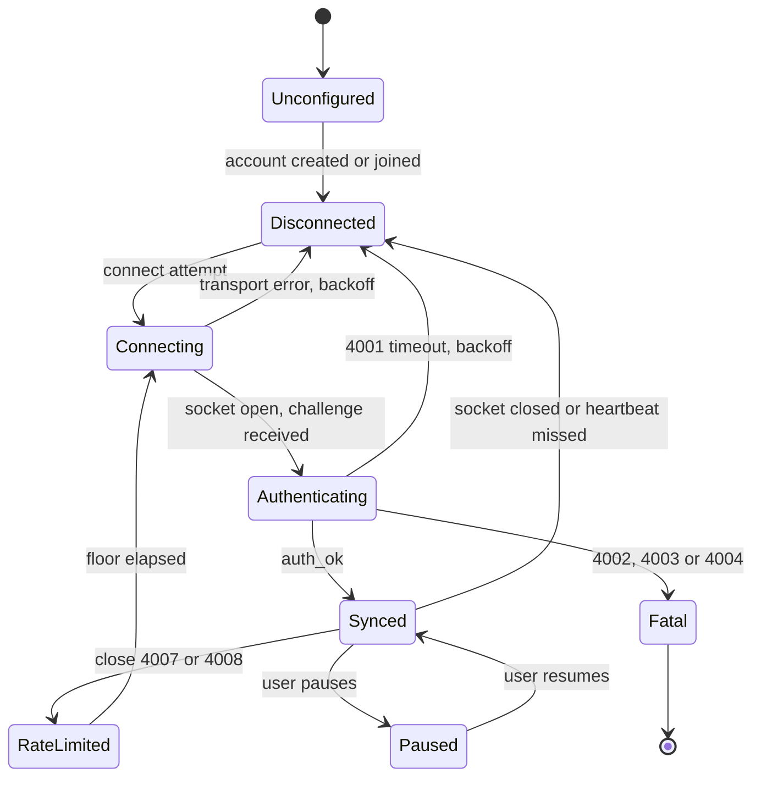

# Architecture

How Asli is put together, and why. The security design lives in `PROTOCOL.md` and
`THREAT_MODEL.md`; this document is about structure, threads and data flow.

> **Status.** All five crates exist and the relay is deployed. Text and images sync in both
> directions on Linux, verified against a live relay. The Windows and macOS backends are written
> and cross compile, but no Win32 or AppKit call in them has ever executed, so treat anything
> specific to those two platforms as designed rather than proven.

## 1. The shape of the system

```
   Device A                                Device B
   +--------------------------+            +--------------------------+
   |  asli-app (tray, UI)     |            |  asli-app                |
   |    +------------------+  |            |    +------------------+  |
   |    | asli-clipboard   |  |            |    | asli-clipboard   |  |
   |    |  Windows backend |  |            |    |  X11 backend     |  |
   |    |  macOS backend   |  |            |    |  Wayland backend |  |
   |    |  X11 backend     |  |            |    |  ...             |  |
   |    |  Wayland backend |  |            |    +--------+---------+  |
   |    +--------+---------+  |            |             |            |
   |             | ClipEvent  |            |             |            |
   |    +--------v---------+  |            |    +--------v---------+  |
   |    | asli-core        |  |            |    | asli-core        |  |
   |    |  state machine   |  |            |    |  state machine   |  |
   |    |  dedup and loop  |  |            |    |  dedup and loop  |  |
   |    |  protocol codec  |  |            |    |  protocol codec  |  |
   |    +--------+---------+  |            |    +--------+---------+  |
   |             |            |            |             |            |
   |    +--------v---------+  |            |    +--------v---------+  |
   |    | asli-crypto      |  |            |    | asli-crypto      |  |
   |    |  seal / open     |  |            |    |  seal / open     |  |
   |    +--------+---------+  |            |    +--------+---------+  |
   +-------------|------------+            +-------------|------------+
                 |  ciphertext over WebSocket TLS        |
                 +------------------+--------------------+
                                    |
                        +-----------v------------+
                        |  relay (Node, ws)      |
                        |  blind forwarder       |
                        |  room = hash(pub_key)  |
                        |  last clip, in memory  |
                        +------------------------+
```

The relay holds no secret, no database and no file. It routes ciphertext by room id, excludes the
sender, enforces quotas, and keeps at most the most recent small clip per room so a device that was
switched off can catch up.

## 2. Crate layout

| Crate | Owns | Status |
|---|---|---|
| `asli-crypto` | Key derivation, identity and room id, join token, AEAD sealing and opening, the handshake signature. No I/O, no threads, no sockets. | **Exists** |
| `asli-core` | Protocol message types and codec, the client state machine, dedup and loop prevention, reconnect policy, content normalization. No I/O. | Planned |
| `asli-clipboard` | The `ClipboardWatcher` and `ClipboardWriter` traits plus one backend per platform. All the operating system ugliness lives here and nowhere else. | Planned |
| `asli-app` | Tray and menu, Slint onboarding and settings windows, configuration, keychain access, autostart, notifications, wiring everything together. | Planned |
| `server/` | The Node relay. TypeScript, `ws`, in memory. | Planned |

The split exists for one practical reason: `asli-core` and `asli-crypto` have no I/O, so the
integration test can drive two headless clients against a real relay with no display server and no
clipboard. That is what makes continuous integration meaningful for a GUI application.

## 3. Threading model

Planned, and shaped by platform constraints rather than preference.

| Thread | Runs | Why |
|---|---|---|
| Main | Tray icon, menu, Slint windows, and on macOS all pasteboard access | macOS requires AppKit pasteboard calls on the main thread. Calling `NSPasteboard` from a background thread is a documented crash in a competing product |
| Clipboard watcher (one per platform backend) | Blocking platform event loop: the Windows message only window, the macOS 500 ms timer, the X11 XFixes loop, the Wayland data-control loop | Each platform wants to own a loop. The watcher sends `ClipEvent` values over a channel and never touches the network |
| Clipboard reader (Windows) | Opens the clipboard with backoff and reads the payload | `OpenClipboard` can block or fail under contention, and `GetClipboardData` on a delay rendered format can block for up to 30 seconds. That must never happen on the message pump |
| Tokio runtime | WebSocket connection, TLS, reconnect timers, heartbeat | One multi threaded runtime, or a current thread runtime, is enough. The socket is the only real I/O |

Communication is by channels, in one direction each way: the watcher sends local changes inward, and
the network task sends received clips outward to the writer. Nothing shares a lock across a platform
boundary.

The macOS main thread rule is the constraint that shapes the rest: the pasteboard poll runs on the
main thread with a timer tolerance, and hands its result to the core over a channel.

## 4. Data flow

### 4.1 A copy on this machine

1. The platform backend observes a clipboard change (an event on Windows, X11 and Wayland, a
   `changeCount` difference on macOS).
2. Debounce 100 ms, resetting on each further event, because one user copy routinely produces
   several change notifications.
3. Read the format or type list first. If a sensitive marker is present, stop here: the clip is not
   read, not hashed, not encrypted and not sent.
4. Read exactly the format we want, on a worker thread where the platform requires it.
5. Normalize: strip a UTF-8 BOM, strip a single trailing NUL, convert line endings to `\n`. Reject
   empty or whitespace only payloads.
6. Check the loop guards (section 5). If this is our own echo, stop.
7. Check the size cap. Over the cap means skipped with a visible notification, never a silent drop.
8. Build the inner plaintext (content type, device id, sequence number, timestamp, content), pad it
   to a bucket, and seal it with the epoch key. `asli-crypto` does this part today.
9. Send the public envelope to the relay. The relay broadcasts it to the other connections in the
   room and retains it if it is small enough.

### 4.2 A clip arriving from another machine

1. The network task receives an envelope and hands it to the core.
2. Reject a repeated `msg_id` (the dedup ring), a message older than the live window, a sequence
   number at or below the highest already seen from that device, or a message whose `device_id` is
   our own. A malicious relay can attempt all four.
3. Open the ciphertext. Failure is a single error with no detail, by design.
4. Seed the loop guard with the hash of the normalized content **before** writing to the clipboard.
   Order matters here: seeding after the write leaves a race that reopens the echo loop.
5. Convert line endings back to the platform convention and write to the clipboard.
6. Record the platform sequence anchor (`changeCount`, `GetClipboardSequenceNumber`, or our own X11
   selection ownership) so the resulting change event is recognised as ours.

## 5. Loop prevention, in three layers

Each layer alone has a failure mode, so all three run. This lives in `asli-core`, not in
the platform backends, so the logic is tested once rather than four times.

1. **Origin id.** Every clip carries `device_id` inside the ciphertext. Drop anything with our own.
   This catches the case hashing misses: a reconnecting device that fetches the retained clip and
   would otherwise rebroadcast its own message.
2. **Content hash ring.** Twenty entries of the hash of the normalized payload, inserted both when
   we write a received clip and when we send a local one, each with a 10 to 30 second TTL. The TTL
   is the important part: without it, deliberately copying the same text twice stops working, which
   is a bug several competing tools have shipped.
3. **Platform sequence anchor.** Snapshot the operating system counter immediately after our own
   write and ignore the matching event. Available on Windows, macOS and X11. Wayland data-control
   has no owner field, so there only layers 1 and 2 apply.

## 6. Client state machine



Two rules that are properties of the machine, not of the code that happens to implement it:

- **Fatal is fatal.** Close codes 4002 (bad signature), 4003 (room does not match the key) and 4004
  (unsupported version) must not trigger a reconnect. A client retrying a bad signature every second
  against a public relay is a self inflicted denial of service.
- **Stability, not connection, resets backoff.** The attempt counter resets only after a connection
  has been authenticated and stable for 60 seconds, otherwise a server that accepts and immediately
  closes produces a tight loop.

Paused means the watcher keeps running but nothing is sent or applied, so the tray can say so
honestly rather than pretending to be offline.

## 7. Configuration and secrets

The root secret and the configuration are stored separately, and only the secret goes to
the keychain.

| Platform | Secret | Configuration |
|---|---|---|
| Windows | Windows Credential Manager | `%APPDATA%\asli\config.toml` |
| macOS | Keychain | `~/Library/Application Support/asli/config.toml` |
| Linux | Secret Service over D-Bus (pure Rust zbus) | `$XDG_CONFIG_HOME/asli/config.toml`, default `~/.config/asli` |

The Linux case has a real failure mode that must be handled as a first class state rather than a
panic: a bare Hyprland or Sway session with no `gnome-keyring-daemon` and no `kwallet` running has
no Secret Service provider at all. The fallback chain is Secret Service, then an encrypted file in
the configuration directory with a clear user facing explanation that it is weaker. See
`THREAT_MODEL.md` for what that weakness actually means.

Configuration holds the relay URL, launch at login, enabled content types, the size limit,
notification preferences and the device id. It never holds key material.

## 8. What is deliberately not here

- **No database.** Not on the client, not on the relay. The relay keeps one recent clip per room in
  memory and forgets it.
- **No clipboard history.** Asli syncs the current clipboard. A history browser is a different
  product, and several good ones already exist locally.
- **No peer to peer.** No mDNS, no NAT traversal, no libp2p. A relay is one moving part instead of
  five, and it works on networks where discovery does not.
- **No plugin system, no scripting, no extension API.** The attack surface of a clipboard tool
  should be as small as its job.
- **No telemetry.** Nothing is collected, so there is nothing to opt out of.
